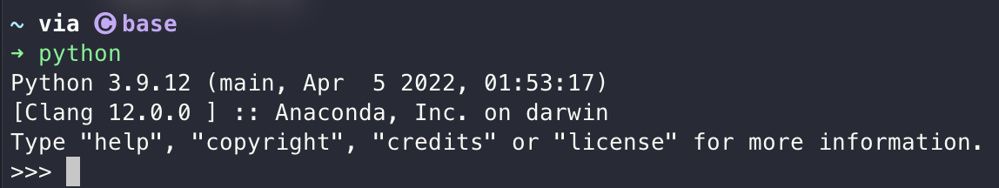

# Python Tutorial

This is a Python tutorial that helps beginners quickly getting start.

[TOC]

## 1. Introduction

Python is a programming language which can be used in lots of areas because of it's simple and easy to understand. For example, it can both be used in  AI area or used for automatically helping you finish your daily work, such as organizing your work and dealing with excel chart.

Learning programming language is like learning a actual language, which has its own syntax, but for communicating with computer.

## 2. Installation

Go to the [official website of Python](https://www.python.org/downloads/) and download the release according to your operating system.

> Windows

If your computer is 64-bit (normally), download `Windows installer (64-bit) ` version and run it. Else, download `Windows installer (32-bit)` version and then run it.

> MacOS

Download `macOS 64-bit universal2 installer` and run it.

> Linux

Use your linux distribution's default package manager, here are some common ones:

```shell
sudo apt install python3
```

```shell
sudo dnf install python3
```

```shell
sudo pacman -S install python3
```

### Check if installation is success

Open terminal (In Windows, use `win+r` and enter powershell, in MacOS, just search terminal in launchpad, in Linux, use different action according to your desktop evironment or windows manager) and enter `python` or `python3`. If installation is successful, this command won't return an error.

(Powershell is a command line program, a text interface system in your computer. It helps you get a deeper control of your system.)



## 3. Getting start

### Trying to make an output

You can create a Python file in any folder you want and call it any name you want. Just make sure it end with `.py` so that your system will recognize it as a Python file.

Then, open it with any text editor you want.

In this example, I create a file called `test.py` on the desktop.

Write the following statement into this file:

```python
print("Hello World!")
```

And then, open the terminal and go to the folder you create the file. (You can go to any folder using `cd any_directory`. For exmaple, to go to desktop, just use `cd Desktop`).st

You can execute a Python file using `python filename.py`. In this example, I run the following command:

```shell
python test.py
```

You will find it output `Hello World!`

In the statement we wrote into the file `test.py`, `print` is a function that takes `"Hello World!"` in the brackets as an input and output it into your terminal and `"Hello World!"` is a string that is input into print function.

### Variables

Variables are used to store something when created. It is like creating a reference for something, like an unknown number in math.

In Python, you can define a variable using `=`. For example, you can create a variable called `a` by the following statement:

```python
a = 1
```

In this statement, you create a variable called `a` and its value is 1.

#### Variable Types

There are 5 standard type of data. They are `number`, `string`,  `list`, `tuple`, `dict`.

You can use `type()` function to view the type of a variable.

##### Number

There are 4 smaller types of data in number. They are `int` which stand for integer, `float` which stand for fraction, `long` which stand for those number who is extra large and `complex` which stand for complex number.

Example: `1` is int, `2.0` is float, `100L` is long and `1+2i` is complex.

##### String

String is a group of character.

Example: `"121eju32dhuiwd"`, `"hahaha"`, `"You are smart."`

##### List

List is a list of object. It allows repeated objects to appear inside. It is defined by `[elements]`

It can contain any object, even another list inside.

Example: `[1, "21221iejfciew", "fceoifcejwi12012", ["2cecew", 2312i], ("efw", rkfr), {1: "you", 2:"are", 3: "smart"}]`

##### Tuple

Tuple is similar to list, but it cannot be changed after defined (list can be changed by some kind of function). It is defined by `(elements)`

It also can contain any object.

Example: `(1, 2, (3, 4), "1fe", "do2", [122e1, 12ewd, ko23])`

##### Dict

Dict stand for dictionary. Its structure is `{key1: value1, key2: value2}`

It can contain most objects in the value position. In the key position, it can only contain hashable object, like string and number.

Example: `{"price": 10, 2: "life", "1": "2", "2e12": "eweew"}`

### Operator

In python, when you do `1+1`, `+` is the operator.

#### Arithmetic Operator

| Arithmetic Operator | Description                 |
| ------------------- | --------------------------- |
| a+b                 | a plus b                    |
| a-b                 | a minus b                   |
| a*b                 | a multiply b                |
| a/b                 | a divide b                  |
| a**b                | The b power of a            |
| a // b              | a divide b with no reminder |

#### Comparison Operator

| Comparison Operator | Description                                  |
| ------------------- | -------------------------------------------- |
| a==b                | compare if a and b is equal                  |
| a!=b                | compare if a and b is not equal              |
| a>b                 | compare if a is bigger than b                |
| a<b                 | compare if a is smaller than b               |
| a>=b                | compare if a is bigger than b or equal to b  |
| a<=b                | compare if a is smaller than b or equal to b |

#### Assignment Operator

| Assignment Operator | Description                                  |
| ------------------- | -------------------------------------------- |
| a=b                 | let a's value be equal to b                  |
| a+=b                | let a's value be a+b                         |
| a-=b                | let a's value be a-b                         |
| a*=b                | let a's value be a*b                         |
| a/=b                | let a's value be a/b                         |
| a%=b                | let a's value be a mod b                     |
| a**=b               | let a's value be b power of a                |
| a//=b               | let a's value be a divide b with no reminder |

### If sentence

If sentence is used to 
